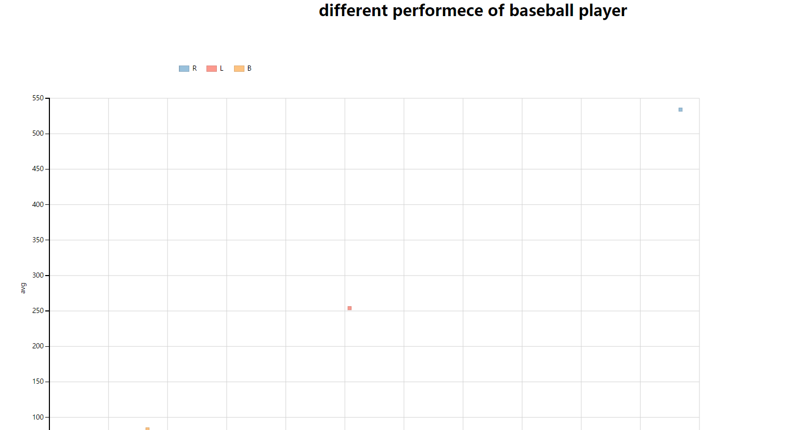
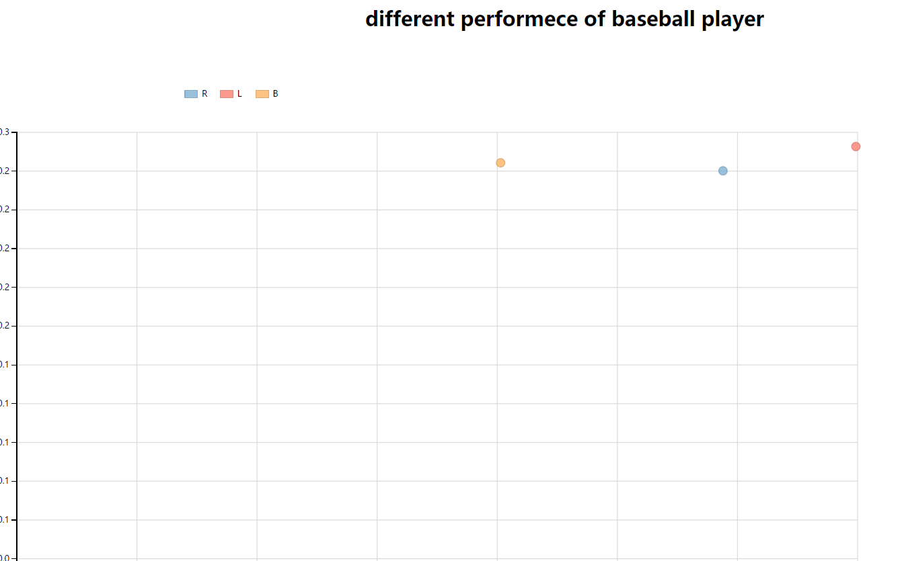

{
 "cells": [
  {
   "cell_type": "markdown",
   "metadata": {},
   "source": [
    "# 概要\n",
    "<ol>\n",
    "<li>本可视化内容主要包括了1157名棒球选手的内容进行了数据分析</li>\n",
    "<li>数据内容主要包括半球选手的身高、体重、习惯使用左右手、击球率及全垒得分情况</li>\n",
    "<li>通过对数据进行了冲洗，删除了其中的空格元素后，对数据进行可视化展示</li> \n",
    "</ol>\n"
   ]
  },
  {
   "cell_type": "markdown",
   "metadata": {},
   "source": [
    "# 设计\n",
    "<ol>\n",
    "<li>首先通过使用python对棒球运动员的相关数据进行了探索性数据分析，以击球率、全垒得分情况为主要的评价指标，身高、体重、左右手情况作为影响指标的因子做了分析，根据分析的情况进行了数据可视化的设计。</li>\n",
    "<li>在设计的时候首先考虑了使用柱状图进行了数据展现，但是发现柱状图很难表现击球率及全垒率的得分情况，选用了散点突来表现不同选手的情况</li>\n",
    "<li>在相同的身高、体重的情况下、默认情况会对击球率、全垒得分进行累加，通过反馈看出，累加情况并不能反映出相同身高、体重及左右手使用情况选手之间的均值，即累加值无法说明同样身高、体重、左右手相同的选手类之间的查边，于是改用了使用类均值作为指标</li>\n",
    "<li>由于图的二维性，X,Y轴只能表现两个主要指标avg,HR的不同情况，根据反馈，对数据进行了分组，由于体重指标相对较多，采用了身高作为不同类型数据的分组依据，而体重数据则作为Z指标，影响散点图中原点的大小。</li>\n",
    "<li>通过EDA的分析，发现左右手的使用情况对选手的表现有着重要印象，根据反馈，添加了handedness作为另外一组分组依据，并且提供了可以和用户交互的按钮选项，通过动画及按钮可以观察不同用手习惯选手的不同表现</li>\n",
    "</ol>"
   ]
  },
  {
   "cell_type": "markdown",
   "metadata": {},
   "source": [
    "# 反馈\n",
    "<ol>由于地方网络情况，该项目并未通过git进行发布，反馈情况通过了周边相关人员的反馈得到如下的信息\n",
    "<li>首先使用的柱状图，不能很好的反映该数据项中五个主要数据项的情况，造成了数据信息的丢失，于是修改成了散点图来表示不同选手之间的差别</li>\n",
    "<li></li>\n",
    "<li>使用散点图的时候，首先想到的是通过handedness对数据进行分类，计算不同handedness选手的均值，结果发现了图上只有三个信息，信息量太小，可视化丢失了包括身高、体重等信息的影响</li>\n",
    "<li></li>\n",
    "<li>尝试过通过三个信息进行分类，即通过[weight,height,handedness]进行分类，发现造成了数据过多而周边人员反映，图片杂乱无章，无法得出想表达的EDA相关内容</li>\n",
    "<li></li>\n",
    "<li>尝试通过weight进行分类，发现分组太多，色彩过于丰富，而无法得出明确表达数据内容内容</li>\n",
    "<li>通过第审阅的反馈，发现，单纯使用weight作为z值来表示圆圈的半径，因为weight这一数据差别较小，在图标上面放映并非很清晰，重新对数据格式进行了更改，分别对不同的weight进行统计，得出了不同weight下面的数量count,添加了一个字段weightcount作为了圆的半径。</li>\n",
    "<li>在本数据中，通过分析得出，使用右手选手，身高78，体重在115左右的运动员，在HR,avg两项数据方面有着绝对明显的优势</li>\n",
    "</ol>"
   ]
  },
  {
   "cell_type": "markdown",
   "metadata": {},
   "source": [
    "# 资源\n",
    "<ol>\n",
    "<li>[dimplejs.org API](https://github.com/PMSI-AlignAlytics/dimple/wiki)</li>\n",
    "<li>[dimplejs.org example](http://dimplejs.org/advanced_examples_viewer.html?id=advanced_storyboard_control)</li>\n",
    "</ol>"
   ]
  }
 ],
 "metadata": {
  "kernelspec": {
   "display_name": "Python 2",
   "language": "python",
   "name": "python2"
  },
  "language_info": {
   "codemirror_mode": {
    "name": "ipython",
    "version": 2
   },
   "file_extension": ".py",
   "mimetype": "text/x-python",
   "name": "python",
   "nbconvert_exporter": "python",
   "pygments_lexer": "ipython2",
   "version": "2.7.13"
  }
 },
 "nbformat": 4,
 "nbformat_minor": 2
}
